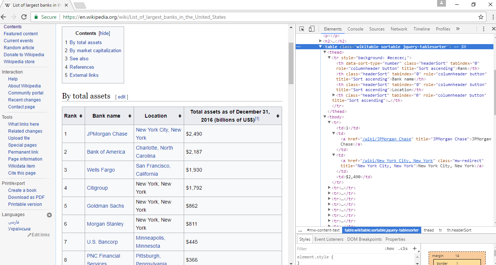

```{r setup, include=FALSE}
knitr::opts_chunk$set(echo = TRUE, warning = FALSE, message = FALSE, eval = FALSE)
```

## What Is Scraping?

## { data-background-image="https://media.giphy.com/media/ohONS2y8GTDoI/giphy.gif"}

## { data-background-image="https://media.giphy.com/media/4UzW8S83pWoKs/giphy.gif"}

## { data-background-image="https://media4.giphy.com/media/l46C6sdSa5DVSJnLG/giphy.gif"}

##  

Scraping is just helping a machine read data intended for humans.

It comes in a few forms:

<span class="fragment fade-up">Screen</span>

<span class="fragment fade-up">Report</span>

<span class="fragment fade-up">Web</span>

## Data Types

Structured

Semi-structured

Unstructured

## Structure Types

<span class="fragment fade-up">json</span>

<span class="fragment fade-up">html/xml</span>

<span class="fragment fade-up">csv</span>


## API

An API will make life much easier on everyone.

Grabbing parts out of the HTML is sometimes necessary.

Sometimes, sites will give us an API.

Always check -- don't bet on it.


## Handy APIs

Twitter

Glassdoor

BLS

U.S. Census

Reddit

Most modern sites have one (or something resembling one).

Sometimes we need to combine both API and general scraping endeavors.

API Limits

## Easing In

## Easing In

Tables are the easiest thing to scrape.

<a href="https://en.wikipedia.org/wiki/List_of_largest_banks_in_the_United_States">Wikipedia</a>

<a href="http://www.usinflationcalculator.com/inflation/consumer-price-index-and-annual-percent-changes-from-1913-to-2008/">Consumer Price Index</a>


## Maybe Meeting A New Friend

No matter your browser, it will have an <span class="func">Inspect</span> tool.

This tool will quickly become your best friend.

## Looking Under The Hood



## Pretty Easy...Right?

### R Style

```{r}
url = 
  "https://en.wikipedia.org/wiki/List_of_largest_banks_in_the_United_States"

bankList = read_html(url) %>% # Read the html
  html_nodes("table") %>% # Grab "table" nodes
  extract2(1) %>% # Extract the first table
  html_table() # Save the table as a data frame
```

## Pretty Easy Again!

### Python Style

```{python}
url = 
  "https://en.wikipedia.org/wiki/List_of_largest_banks_in_the_United_States"
  
banklist = pd.read_html(url)[0]
```


## Learning Some New *Languages*

CSS selectors and XPath make scraping certain objects easier.

The <a href="https://flukeout.github.io/">CSS Diner</a> is a favorite!


## Scraping Services

For these easy tables, we might be able to use a service.

Many free ones are available.

[import.io](https://www.import.io/)
[dexi.io](https://app.dexi.io/)

Excel Web Query is handy for grabbing tables.

It can even be *refreshed*.

## Did You Bring A Machine?

If so, let's give Excel a quick try.

We should be able to do it in under two minutes.

## { data-background-image="http://ressources.blogdumoderateur.com/2015/12/hackerman.gif"}

## Unstructured Data

Whether it is 1 or 1000, tables are pretty easy to scrape.

But...not everything comes in tabular form.

This is where things become *fun*.

## Looking For Trouble

Most modern sites are pretty well constructed.

<a href="https://www.yelp.com/biz/capri-granger">Yelp Reviews</a>


## Reviews

```{r, eval = TRUE, echo = FALSE}
library(rvest)

url = "https://www.yelp.com/biz/capri-granger"

yelpHTML = read_html(url)

ratings = yelpHTML %>% 
  html_nodes(".review-wrapper .review-content .i-stars") %>% 
  html_attr("title") %>% 
  stringr::str_extract("[0-5]")

reviews = yelpHTML %>% 
  html_nodes(".review-wrapper .review-content p") %>% 
  html_text()

DT::datatable(data.frame(ratings, reviews), style = "bootstrap")
```


## Still Nothing Too Hard

```{r, echo = TRUE, eval = FALSE}
url = "https://www.yelp.com/biz/capri-granger"

yelpHTML = read_html(url)

ratings = yelpHTML %>% 
  html_nodes(".review-wrapper .review-content .i-stars") %>% 
  html_attr("title") %>% 
  stringr::str_extract("[0-5]")

reviews = yelpHTML %>% 
  html_nodes(".review-wrapper .review-content p") %>% 
  html_text()
```


## Getting Messy

Let's play a little game.

<a href="http://mendoza.nd.edu/research-and-faculty/directory/">MCoB Directory</a>


## Regular Expression

| Pattern             | Matches                          |
|---------------------|----------------------------------|
| `Ph.? ?D`           | `Ph.D`, `Ph. D`, `Ph. D`, `Ph D` |
| `\d{3}-\d{3}-\d{4}` | Phone numbers                    |

[RegExr](http://regexr.com/)


## Dining Hall Fun

<a href="http://www3.nd.edu/~gjiang3/dining/">What's good today?</a>

## { data-background-image="https://media3.giphy.com/media/l3UcrZHrGW2CjHXqM/giphy.gif"}